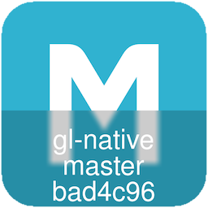

# iconoblast

App icon dev info burning for iOS and Android. 



Inspired by and borrowing heavily from [@krzysztofzablocki](https://github.com/krzysztofzablocki)'s [IconOverlaying](https://github.com/krzysztofzablocki/IconOverlaying) and brought to my attention by [@sranderson](https://github.com/sranderson). 

## Usage

Copy `iconoblast` someplace into your path like `$HOME/bin` or `/usr/local/bin`. 

```bash
iconoblast icon.png f801f5b master gl-native
```

The idea is you'd run this yourself in an Xcode build phase or however we'll eventually automatically do this in Android Studio on each app icon in your build product. 

If you want a bit more Xcode automation and figuring out stuff for you, check out the original [IconOverlaying](https://github.com/krzysztofzablocki/IconOverlaying). My goal here was to make this more generic and usable on non-Apple platforms. 

## Other tools

- [Badge](https://github.com/HazAT/badge) — burn images into your icon
